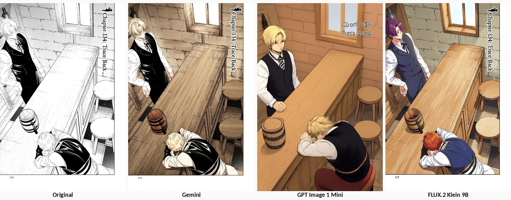
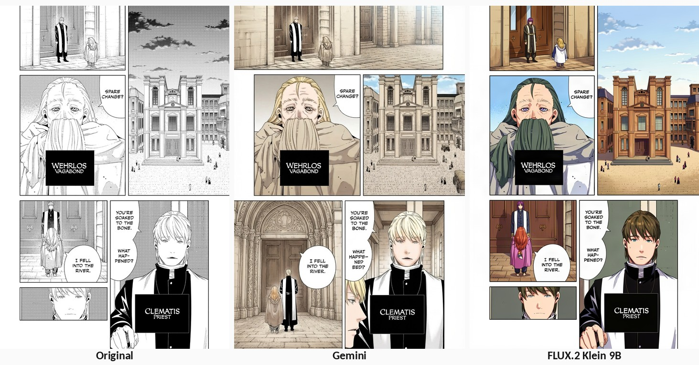

# Manga Colorization — Methods Compared

A practical comparison of AI-assisted manga colorization services on **quality and cost**. Three commercial image-generation models are used to colorize the same source chapter with the same character reference atlas and the same sequential page-context strategy (each page sees the previously colorized page, so colors stay consistent across the chapter).

- **Input:** chapter 134 of a manga, 18 pages at 1200×1800 (JPEG data in `.png` files), kept unmodified under `data/`.
- **References:** labelled character reference atlas built from `data/refs/`.
- **Strategy:** colorize pages in filename order; from page 2 onward, feed the previous generated page back as context.
- **Outputs:** one fresh timestamped run directory per invocation; never overwritten.
- Full index and method details: [`methods.md`](methods.md). Reproduce instructions are in each method's `README.md`.

> Prices are USD paid-tier estimates, dated **2026-08-08**, excluding taxes. What is *measured* (metered usage × price) vs *estimated* (price-card math) is labeled in the tables.

## Methods

| Method | Model / service | Output | Cost / page (measured) | Full chapter |
|---|---|---|---|---|
| [Gemini reference atlas + sequential context](research/colorization_methods/gemini-reference-cache-sequential/) | Google Gemini 3.1 Flash Lite Image (Nano Banana 2 Lite) | 848×1264 JPEG | **$0.03451** (18 pages, measured) | **$0.62113** |
| [GPT Image 1 Mini low + sequential context](research/colorization_methods/openai-gpt-image-1-mini-low-sequential/) | OpenAI `gpt-image-1-mini`, `quality=low` | 1024×1536 JPEG | **$0.00827** (1-page smoke test only) | not measured — estimated ≈ $0.108 output + input tokens |
| [fal FLUX.2 Klein 9B Edit + sequential context](research/colorization_methods/fal-flux-2-klein-9b-edit-sequential/) | fal `fal-ai/flux-2/klein/9b/edit`, 4 steps | 1216×1824 PNG | **$0.05676** (pages 2–18, estimated) | **$1.07956** (18 pages + 1 recovery call, estimated) |

## Pipeline: panel-wise colorization (`pipeline_v1`)

Current project state — a full colorization pipeline that colorizes **per panel**
instead of per page: detect panels (YOLO26n), extract them numbered in Japanese
reading order, detect the characters in each panel (OpenRouter
`google/gemma-4-31b-it`), colorize each panel with the step-distilled FLUX.2
Klein 9B + manga LoRA at 4 steps using an atlas **filtered to the detected
characters**, then stitch the colorized panels back onto the page. Everything
outside the panels stays black & white.

### How it works

For each manga page, the pipeline runs five stages in order. Each run creates a
fresh timestamped directory `pipeline_v1/output/YYYYMMDD-HHMMSS/` with four
numbered intermediate directories (`1_panels/`, `2_characters/`,
`3_colorized/`, `4_stitched/`) plus an incremental `manifest.json` recording the
command, configuration, inputs, per-panel results and measured costs.

1. **Panel detection** — [`YOLO26n`](https://huggingface.co/leoxs22/manga-panel-detector-yolo26n)
   (`leoxs22/manga-panel-detector-yolo26n`, Apache-2.0; weights auto-downloaded
   to `pipeline_v1/models/`) finds the panel boxes on the page; the `text`
   class is ignored and detections below the confidence threshold are dropped.
2. **Extraction in Japanese reading order** — panels are clustered into
   horizontal bands (top to bottom) and ordered right to left within each band,
   then cropped as `panel_0001.png …` into `1_panels/<page>/`. The geometry
   (boxes + confidence + reading order) is saved to `panels.json` — it is
   needed again at the end to stitch — and a numbered `overlay.png` is written
   for visual QA.
3. **Per-panel character detection** — one OpenRouter call per panel with
   `google/gemma-4-31b-it` (same prompt/JSON contract as the
   [OpenRouter VLM method](research/character_detection_methods/character-detection-openrouter-vlm/)):
   the panel image plus a list of the canonical reference characters (from
   `data/refs/`) with hints; the model answers
   `{"characters": ["Frieren", …]}`. Results (including cost from
   `usage.cost`) go to `2_characters/<page>/`.
4. **Per-panel colorization** — for each panel, a labelled atlas is built from
   the **reference images of the detected characters only**, and the panel
   (`#1`) + filtered atlas (`#2`) are sent to the self-hosted Spark server
   running the step-distilled FLUX.2 Klein 9B + thedeoxen
   manga-colorization-by-reference LoRA (trigger `mngclranm`, **4 steps**;
   same backend as the
   [LoRA method](research/colorization_methods/flux-2-klein-9b-base-lora-edit-sequential/)).
   Each panel is colorized at the resolution **closest to its native size with
   both axes multiples of 16** (FLUX VAE constraint). A panel with **no
   detected characters** is colorized panel-only, without an atlas. Outputs go
   to `3_colorized/<page>/` alongside the per-panel atlas used.
5. **Stitching** — each colorized panel is resized back to its exact original
   box (from `panels.json`) and pasted onto the page at the recorded position;
   gutters, margins, text and any page without panels stay black & white. The
   final pages land in `4_stitched/`.

Flags of interest: `--skip-first N` / `--limit N` (page selection),
`--steps` / `--from-step` / `--resume <run-dir>` (partial or resumed runs),
`--mock` (offline demo with fake backends), `--num-inference-steps` (4 for the
step-distilled model), `--lora-scale`, `--seed`. See
[`pipeline_v1/README.md`](pipeline_v1/README.md) for the full CLI and setup.

Status: **v1 works end-to-end**. Two real runs (2026-08-08):

- Chapter 134 smoke — 1 page / 5 panels: **$0.00040965** OpenRouter + $0 FLUX, 75 s
- Volume 1, chapter 1 — 5 pages / 18 panels: **$0.00137551** OpenRouter + $0 FLUX, 358 s

Debug views (bbox + reading order + detected characters on the colorized pages)
for the volume-1 run:

| p003 (6 panels) | p004-p005 (1 panel) | p006 (0 panels) | p007 (7 panels) | p008 (4 panels) |
|---|---|---|---|---|
|  |  |  |  |  |

Full evaluation (what works / what to improve) and the improvement backlog:
[`pipelines.md`](pipelines.md). Setup and usage:
[`pipeline_v1/README.md`](pipeline_v1/README.md).

## Before / after — page 1

Page 1 is the same monochrome input for every method (no previous-page context, so this is where each model invents a palette for anything not covered by the reference atlas).

## Before / after — page 2 (page-by-page consistency)

Page 2 is the first page to receive **previous-page context**: each method is given its own page-1 colorization and asked to keep colors consistent. It shows how well the sequential mechanism carries the palette (and its errors) forward. GPT Image 1 Mini has no page-2 output because only a 1-page smoke test was run.

Page 2 and later pages colorized with this strategy can be inspected in the full run directories ([Gemini `20260808-003106`](research/colorization_methods/gemini-reference-cache-sequential/output/20260808-003106/), [fal `20260808-011051`](research/colorization_methods/fal-flux-2-klein-9b-edit-sequential/output/20260808-011051/)); note these are local, gitignored artifacts, so only the page-1/page-2 samples above are tracked in this repository.

## Quality notes (sampled pages, full chapter where noted)

| Method | Strengths | Known failures |
|---|---|---|
| **Gemini** (full 18-page run) | Coherent subdued palette; panels and linework mostly preserved; consistent silver/white hair and blue eyes; previous-page context worked pages 2–18. | Invented a hanging lamp on page 1; malformed chapter-title lettering; large near-monochrome areas; color bled into the outer margin of page 18. |
| **GPT Image 1 Mini** (1-page smoke test) | Coherent palette; two figures recognizable. | Substantially redrew/smoothed the linework, cropped margins and the printed page number, changed clothing/scene details, replaced the chapter title with malformed text. Failed the "add color only" requirement; continuity untested. |
| **fal FLUX.2 Klein** (full 18-page run) | Best structural preservation: panels, margins, page numbers, and dialogue kept; coherent detailed palette. | Regenerated/smoothed linework; changed faces, hair, clothing, small details; atlas colors unreliable (non-silver Frieren on page 18); false-positive safety block produced a black page 18, recovered separately with the checker disabled. |

Bottom line: **fal FLUX.2 Klein** is structurally the most faithful and visually polished but the most expensive and still redraws rather than strictly colorizes. **GPT Image 1 Mini low** is by far the cheapest per page but the least faithful at low quality. **Gemini 3.1 Flash Lite Image** sits in the middle on both axes. None of the three achieves strict "color only" processing on this test set.

## Comparability caveats

- **Different output resolutions:** Gemini 848×1264 JPEG, OpenAI 1024×1536 JPEG, fal 1216×1824 PNG. Not resolution-equivalent.
- **Different run scopes:** Gemini and fal are full 18-page runs; OpenAI is a 1-page smoke test (its full-chapter cost is an estimate, not measured).
- **Cost basis:** measured metered usage for Gemini and the OpenAI smoke test; price-card estimates for fal (the API does not return a billed amount). fal's full-chapter figure includes a 19th recovery request for the false-blocked page 18.

## Reproduce

Every method has its own directory with `README.md` (setup + exact commands), `run.py`, prompt, and requirements. See [`methods.md`](methods.md) for the full index. API keys are read from `.env` at runtime; the `.env` file itself is not committed.

## Volume tooling (`script/`)

Utility scripts for manga volumes (Python 3 stdlib only, runnable from any directory):

- `script/extract_pages.py` — unpack `.cbz` volumes from `data/volumes/` into per-volume page folders under `data/page_per_volume/<volume-name>/`. Pages keep their original filenames (zero-padded, so natural sort = reading order), extraction is resumable, and `--force` re-extracts. `--volume` filters by name substring.
- `script/merge_to_cbz.py` — pack a folder of pages back into a `.cbz`, natural-sorted. Only image files by default (`--all` to include everything); output defaults to `<folder-name>.cbz` in the current directory, override with `--output`.

Both `data/volumes/` and `data/page_per_volume/` are gitignored; extracted pages are local artifacts, not tracked in this repository.
