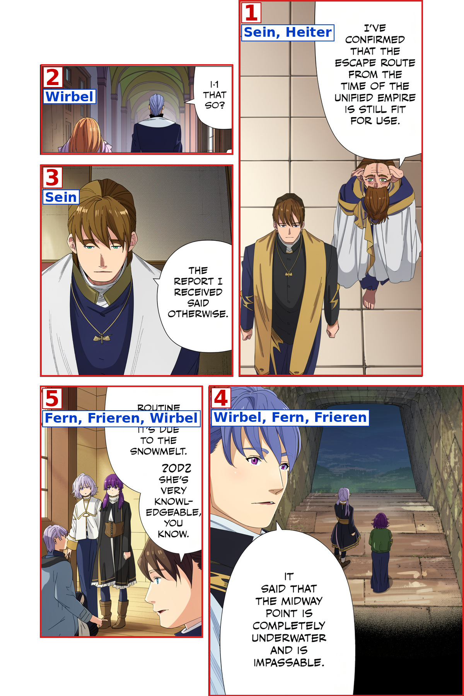
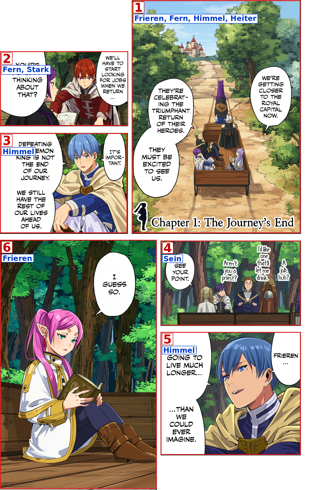
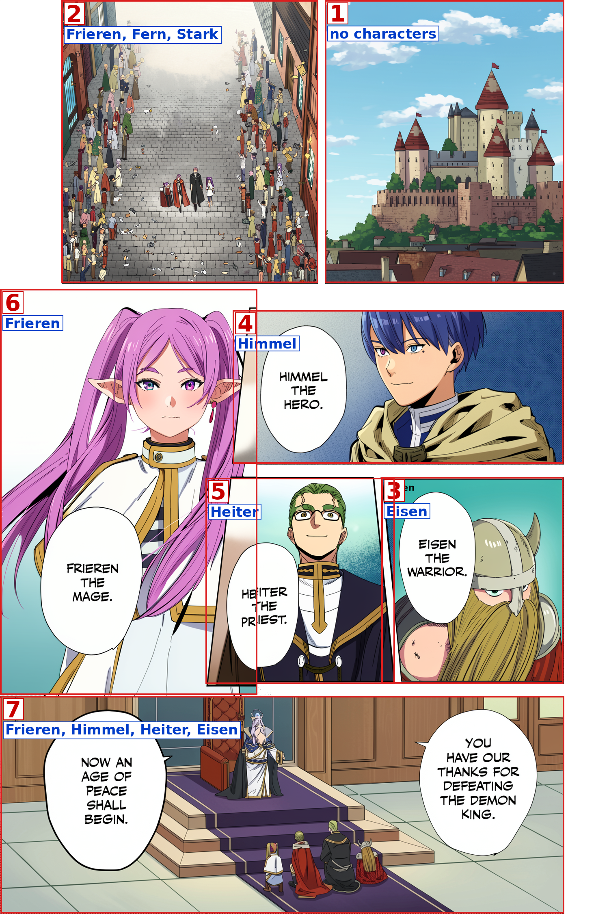
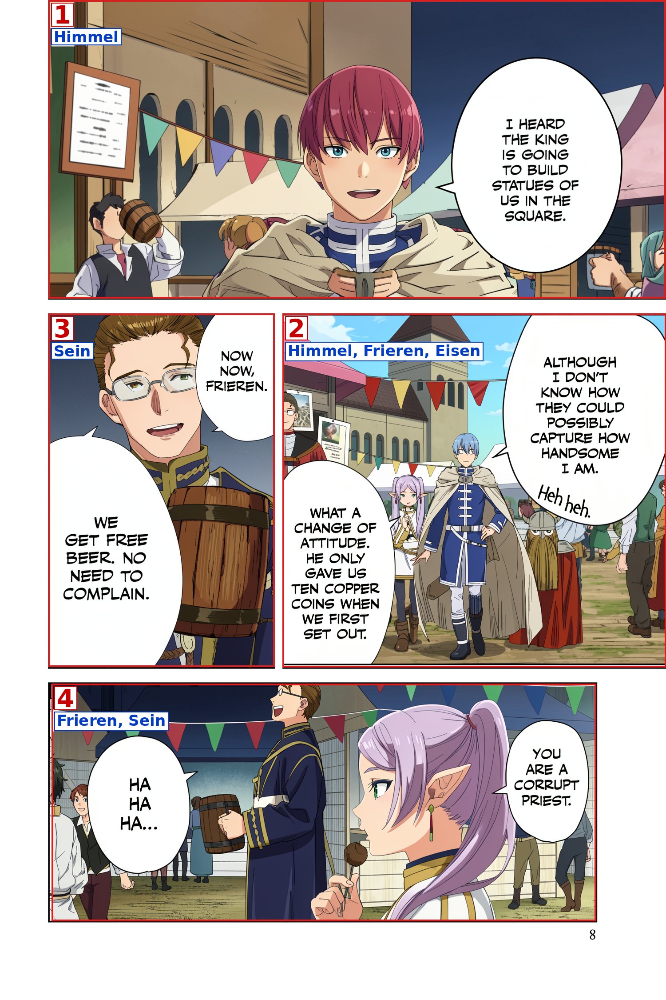
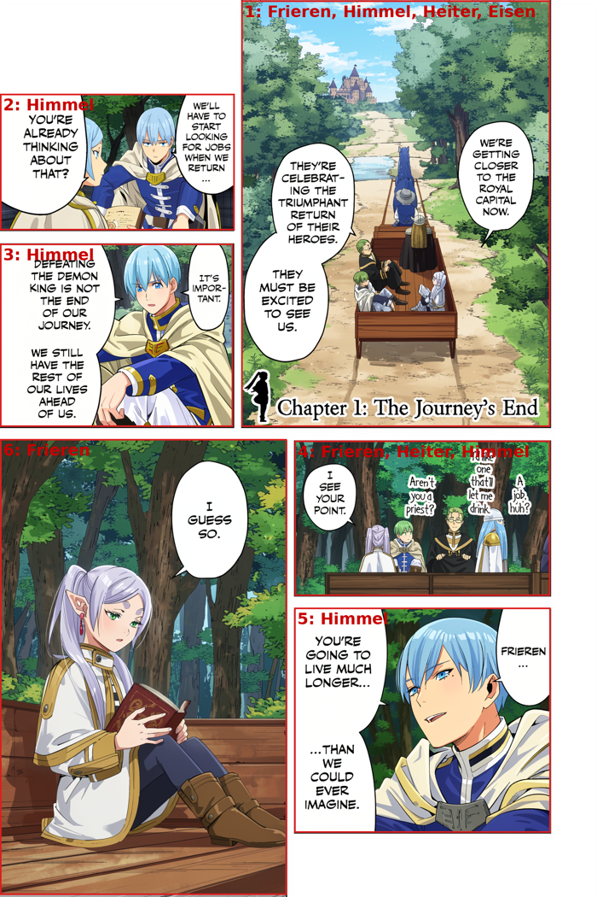
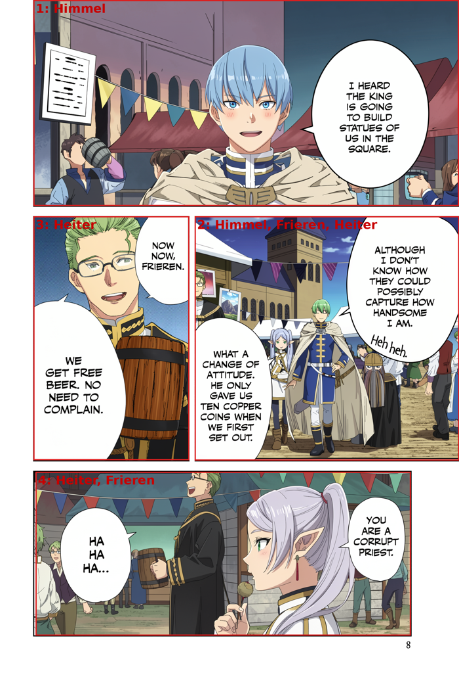
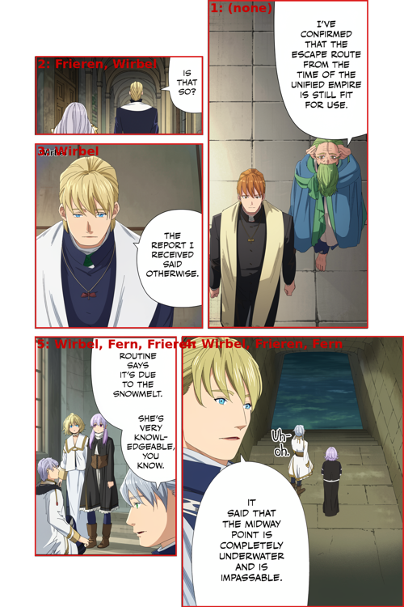

# pipeline_v1 — first real evaluation

Hands-on review of the first real runs of the panel-wise colorization pipeline
([`pipeline_v1/`](pipeline_v1/README.md)): panels are detected with YOLO26n,
extracted in Japanese reading order, characters are detected per panel with
OpenRouter `google/gemma-4-31b-it`, each panel is colorized with the
step-distilled FLUX.2 Klein 9B + manga-colorization LoRA (4 steps) using an
atlas filtered to the detected characters, and the colorized panels are
stitched back onto the page.

## Experiments

### Chapter 134 (smoke test)

- **Run:** [`pipeline_v1/output/20260808-221331/`](pipeline_v1/output/20260808-221331/)
- **Input:** `data/chapter_134/0134-004.png` (1200×1800) — 1 page, 5 panels
- **Cost:** $0.00040965 OpenRouter (5 calls, all ok) + $0 FLUX (self-hosted);
  wall time 75 s

Debug view (bbox + reading order + detected characters on the colorized
stitched page):

### Volume 1, chapter 1 (5 pages)

- **Run:** [`pipeline_v1/output/20260808-223234/`](pipeline_v1/output/20260808-223234/)
- **Input:** `data/page_per_volume/… v01 …/`, pages p003–p008 (1500×2250,
  incl. a 3000×2250 spread), `--skip-first 3 --limit 5` — 5 pages, 18 panels
- **Cost:** $0.00137551 OpenRouter (18 calls, all ok) + $0 FLUX (self-hosted);
  wall time 358 s
- **Note:** p006 (a full-page illustration, ~2% ink, no panel frames) is
  detected as 0 panels and stays black & white; the p004-p005 spread is
  detected as a single large panel (2896×2256).

Debug views (bbox + reading order + detected characters on the colorized
stitched pages):

| p003 (6 panels) | p004-p005 (1 panel) | p006 (0 panels) | p007 (7 panels) | p008 (4 panels) |
|---|---|---|---|---|
|  |  |  |  |  |

## What works

- **Panel detection** — the YOLO26n detector finds the panel layout reliably
  and the reading-order numbering matches how the pages read (verified by eye
  on 0134-004 and on the volume pages).
- **Character detection** — the calls are cheap and often identify distinctive
  characters correctly, but the lists do not always match the story context.
  For example, p003 panel 2 reports Fern/Stark during the hero-party flashback,
  and p008 panel 3 reports Sein for Heiter.
- **Colorization** — the distilled 9B + LoRA at 4 steps produces coherent
  colors per panel; each panel keeps its own composition and linework. It is
  also fast: 3.8–13.5 s per panel at chapter size, 71.7 s for the huge spread.
- **Stitching** — the colorized panels are pasted back at the right positions
  and the rest of the page (gutters, margins, text outside panels) stays
  untouched.

## What to improve

### Character detection misses or confuses characters

On chapter 134 some characters appearing in panels are **not in the reference
set** (`data/refs/` has only 17 canonical characters), so they can never be
detected. Even characters that are present in the reference set can be confused
when a crop removes page-level story context, as seen with Heiter/Sein and with
the chapter-1 flashback cast.

Ideas:
- Keep a complete character list for the series, but pass only a cached
  chapter-specific cast shortlist to each detection request:
  <https://frieren.fandom.com/wiki/Category:Characters>
- Detect all numbered panels in one page-level call so the VLM can use dialogue
  and neighboring panels as context; fall back to a per-panel call only for an
  uncertain result.
- Cache chapter descriptions or manually curated cast metadata as optional
  hints rather than downloading them on every run.

### Colored references are not followed reliably

The 18 files in `data/refs/` represent 17 canonical characters (Frieren has two
filenames) and are already colored anime character sheets. The atlas therefore
does carry canonical colors. The observed wrong colors — for example Frieren's
silver hair becoming magenta — are failures to follow the reference, not missing
reference information.

The implementation currently passes detected names to the atlas builder but not
to the FLUX text prompt. The prompt only asks the model to use the labelled atlas,
so the four-step model must read the labels, associate each sheet with a manga
figure, and infer all of the colors from the image.

Ideas:
- Store explicit canonical color profiles (hair, eyes, clothing, accessories,
  and outfit/era variants) next to the references and inject the detected
  characters' profiles directly into the FLUX prompt.
- Keep the colored atlas as visual evidence, but do not rely on its labels as
  the only connection between a character name and its palette.
- Compare prompt/atlas variants on a small fixed set of failing panels with a
  fixed seed before running another volume sample.

### Cross-panel consistency

Colors are chosen panel by panel; a character can end up with slightly
different colors in different panels of the same page (or across pages).

Ideas:
- First enforce the same explicit canonical color profiles in every panel and
  use fixed seeds for reproducible comparisons.
- Defer a generative page-level harmonization pass until prompt-level palette
  conditioning has been measured; an extra pass can redraw linework or propagate
  an already-wrong palette.

### Correctly detected character, wrong colors

Even when the character is correctly detected and its atlas entry is passed,
the model does not always apply the right colors to it.

Idea:
- If prompt-level conditioning is still insufficient, verify a contact sheet of
  all colorized panels once per page and re-colorize only flagged panels, with a
  one-retry limit. Avoid one paid verification call per panel.

---

## V1.1 — fixed evaluation set, explicit palettes, page-level detection

V1.1 (epic 002, tasks 0001–0004) targets the V1 failures: character confusion
(Heiter/Sein, flashback cast), out-of-vocabulary identity (Clematis), palette
adherence (Frieren's magenta hair), the p006 zero-panel page, and the oversized
spread. It adds a fixed evaluation contract
([`pipeline_v1/evaluation/v1_1_cases.json`](pipeline_v1/evaluation/v1_1_cases.json))
and the real-network **integration suite** (`pytest pipeline_v1/tests -m integration`,
no mocks) that runs the fixed set live against the real backends; the earlier
`evaluate.py` CLI (auto-scored detection + human `color_review.md`) has been
retired in its favour. All V1.1 runs used a fixed seed
(`1337`); V1 used the default (random) seed.

Changed settings vs V1: **per-page character detection** (one paid call per
page + cropped fallbacks) instead of one call per panel; **explicit canonical
palettes** injected into the FLUX prompt (`character_profiles.json`);
**full-page fallback** for zero-panel pages; **2.0 MP request cap** for
oversized inputs; `max_tokens` 2048 → 1024; configurable inter-call delay.

### Runs (2026-08-09, all self-hosted FLUX, $0/call + electricity)

| Run | Input | Detection | Colorization | OpenRouter cost | Wall time |
|---|---|---|---|---|---|
| Fixed COL experiment ([20260809-005032](pipeline_v1/output/20260809-005032/)) | P003/P007/P008 COL panels, forced identities | 0 calls, $0 | 3 FLUX | $0 | 36.6 s |
| Volume 1, ch.1 5 pages ([20260809-010458](pipeline_v1/output/20260809-010458/)) | p003–p008, `--skip-first 3 --limit 5`, cast `c001` | 5 page calls + 0 fallbacks | 19 FLUX (incl. p006 fallback) | **$0.00050690** | 276.6 s |
| Chapter 134 smoke ([20260809-011110](pipeline_v1/output/20260809-011110/)) | 0134-004, cast `ch134` | 1 page call | 5 FLUX | $0.00014994 | 50.7 s |
| Full-roster detection ([20260809-013917](pipeline_v1/output/20260809-013917/)) | P003+P008 page-level, **no** cast shortlist | 2 page calls | 0 FLUX | $0.00032604 | — |
| Layout run ([20260809-014132](pipeline_v1/output/20260809-014132/)) | p006 + generated blank page | 0 calls | 1 FLUX (p006 only) | $0 | — |
| Spread cap A/B @3.5 MP ([20260809-014331](pipeline_v1/output/20260809-014331/)) | spread panel, seed 1337 | 0 | 1 FLUX | $0 | — |

### Character detection — page-level, measured on the task-0001 ground truth

Detection is scored automatically (set comparison, exact TP/FP/FN; the
evaluator never scores a forced ground-truth record as a detection):

| Case | V1 (per-panel) | V1.1 (page-level, shortlist `c001`) | V1.1 (page-level, full roster) |
|---|---|---|---|
| DET-001 (P003:2, expected Frieren,Himmel) | [Fern, Stark] (tp0 fp2 fn2) | [Himmel] (tp1 fp0 fn1) | [Frieren] (tp1 fp0 fn1) |
| DET-002 (P003:4, expected Frieren,Himmel,Heiter,Eisen) | [Sein] (tp0 fp1 fn4) | [Frieren,Heiter,Himmel] (tp3 fp0 fn1) | [Frieren] (tp1 fp0 fn3) |
| DET-003 (P008:3, expected Heiter) | [Sein] ✗ | [Heiter] ✓ | [Heiter] ✓ |
| DET-004 (P008:4, expected Frieren,Heiter) | [Frieren,Sein] (tp1 fp1 fn1) | [Heiter,Frieren] ✓ | [Heiter,Frieren] ✓ |
| **Precision / recall** | **0.167 / 0.111** | **1.000 / 0.778** | **1.000 / 0.778** |

The Heiter/Sein confusion is fixed by page-level context alone (the full-roster
run scores identically to the shortlist run — the shortlist is not the reason).
Remaining detection misses are era/under-detection: DET-001/002 still miss a
hero-party member (Himmel on P003:2, Eisen on P003:4) because the model
interprets the flashback cast inconsistently.

OOV-001 (chapter 134, panel 3) **still fails**: Clematis is not in the 17-name
reference vocabulary and the model forced her to **Wirbel** instead of leaving
her unknown. The page-level prompt instructs unknown characters to be reported
as `uncertain`, but the model does not comply reliably.

Run 20260809-091129 (panel-page detection over volume 1) exposed a second
look-alike confusion: on **p130** (ch. 5 "Killing Magic") 4 of 6 panels were
detected as **Flamme** — Frieren's look-alike master, who is not in chapter 5's
cast — where the cast is Frieren/Fern (panel 4 even kept Frieren but forced
Fern to Flamme). Recorded as the six-panel page set **DET-005..010** in the
evaluation fixture, with the observed misdetections as per-case baselines.

### Color — explicit palettes (human review pending)

The three COL cases were run with forced ground-truth identities (Run
20260809-005032, 0 paid detection calls) and also produced in the volume run
with the detected identities. The generated image, monochrome input, atlas and
fixture expectation for every variant are in the run's
[`evaluation/color_review.md`](pipeline_v1/output/20260809-005032/evaluation/color_review.md);
verdicts are **pending user review** by design (no automated color verdict).
Objective signals only: the dominant saturated color in all three outputs is
warm gold/white (no magenta-dominant color), and COL-002's hair region is very
light — consistent with the injected "silver-white hair" palette, but this is
not a pass/fail judgement.

The FLUX prompt now contains explicit canonical colors, e.g. for COL-001/002:
`Frieren: silver-white hair; green eyes; white coat with gold trim.` recorded
with the profile hash in the manifest (`palette_instruction`,
`profiles_sha256`). `--force-characters` made the fixed experiment free of paid
detection calls.

### Full-page art and oversized inputs

- **LAY-001** ✓ — p006 (full-page illustration, no panel frames) now produces
  one synthetic full-page panel (`provenance: full-page-fallback`), is
  colorized (capped 1152×1728, 22.3 s) and stitched back to exactly 1500×2250.
  Previously the page stayed black & white. See
  [v11-p006-fullpage.png](docs/pipeline_v1/v11-p006-fullpage.png).
- **LAY-002** ✓ — a generated all-white 1500×2250 page is skipped with an
  explicit `blank-page` record, zero character/FLUX calls, and an unchanged
  1500×2250 final page.
- **SIZE-001** ✓ — the 2895×2250 spread is capped to 1600×1248 (multiples of
  16, 1,996,800 px ≤ 2.0 MP; original/requested size, scale and applied cap
  recorded). The final stitched page stays exactly 3000×2250.

### Spread size-cap A/B (same seed 1337)

| Cap | Request size | Spread FLUX latency | vs V1 (2896×2256, 71.7 s) |
|---|---|---|---|
| 2.0 MP (default) | 1600×1248 | 28.9 s | −60% |
| 3.5 MP | 2112×1648 | 43.5 s | −39% |

Outputs for visual comparison:
[2.0 MP](docs/pipeline_v1/v11-spread-cap-2.0MP.png) ·
[3.5 MP](docs/pipeline_v1/v11-spread-cap-3.5MP.png). 2.0 MP stays the default
(SIZE-001 is the deterministic 2.0 MP fixture); the largest cap with no visible
regression is a user judgement pending on these two images.

### Cost summary

- V1 total (ch134 + 5 pages): **$0.00178516** OpenRouter.
- V1.1 total (all six runs above): **$0.00098288** — 45% less, and the
  5-page comparison alone is **$0.00050690** (2.7× under V1's $0.00137551 for
  the same input). Page-level detection used 5 paid calls instead of 18.
- FLUX stays $0/call (self-hosted); wall time for the 5-page run dropped from
  358 s to 276.6 s **while colorizing one more panel** (p006 fallback).

### Integration-suite evaluation (2026-08-09, live backends, seed 1337)

The evaluation of `evaluation/v1_1_cases.json` now runs as stage-isolated
real-network pytest (`-m integration`): committed pre-cropped panels in
`pipeline_v1/tests/data/`, real gemma-4-31b-it detection, real FLUX on Spark +
real gpt-5.6-luna validation, real YOLO; one timestamped run per session in
`pipeline_v1/tests/output/`. Findings (measured `usage.cost` ≈ $0.0022/session):

- **Detection (panel-only mode): 1/5 pass.** DET-003 (Heiter close-up) passes;
  DET-001 reproduces the exact V1 baseline `{Fern, Stark}` (flashback cast),
  DET-002 collapses to `{Fern, Heiter, Eisen}` (missing Himmel), DET-004
  misses Heiter, and OOV-001 forces Clematis to **Denken** (not reported
  unknown). Panel-only mode cannot meet the fixture's expectations for the
  flashback-era cases — the V1.1 page-level mode is why those were fixed
  before; the integration suite keeps the crop-only contract and tracks the
  failures. The fixture has since grown **DET-005..010** (volume-1 p130's six
  panels, Flamme/Frieren look-alike confusion observed in panel-page run
  20260809-091129); their panel-only verdicts are pending the next live run.
- **Color: 3/5 pass, with a confirmed real defect.** COL-003 (Heiter) passes.
  **COL-004 passes** — the live left-to-right palette is true at seed 1337
  (green / blue / pale white-lavender / golden yellow-brown), i.e. the V1.2
  palette-geography failure from run 20260809-091129 is gone with the current
  atlas + palette conditioning. COL-001 and COL-002 (Frieren, two crops) fail
  consistently: the hair renders **lavender-purple (forbidden)** instead of
  silver-white, eyes and white/gold outfit correct — confirmed by the real
  VLM, no longer "pending user review".
- **Layout 2/2, size 1/1:** LAY-001 full-page fallback (box 0,0,1500,2250),
  LAY-002 blank-page skip, SIZE-001 request capped 2895×2250 → 1600×1248.

### Remaining known failures (honest)

1. OOV-001: Clematis forced to a known character (Denken in panel mode, Wirbel
   in page mode) — unknown-identity handling needs a "refuse to guess"
   constraint; the test asserts it and fails on purpose.
2. DET-001/002/004: crop-only panel detection cannot resolve the flashback-era
   confusion (present-day cast, multi-character collapse, missed Heiter); the
   page-level mode that fixed DET-002 in V1.1 is outside the crop-only
   integration contract.
3. COL-001/002: Frieren's hair renders lavender-purple instead of the required
   silver-white — a consistent palette-adherence defect confirmed by the real
   VLM; candidate for the next colorization fix (V1.2).
4. Task 0005 (page-batched verification + bounded retries) is **gated**: it is
   implemented only if explicit palette conditioning still leaves material
   color-adherence failures after the integration-suite verdicts above.

Debug views (bbox + reading order + detected characters on the colorized
stitched page):

| vol1 p003 | vol1 p008 | ch134 0134-004 |
|---|---|---|
|  |  |  |
